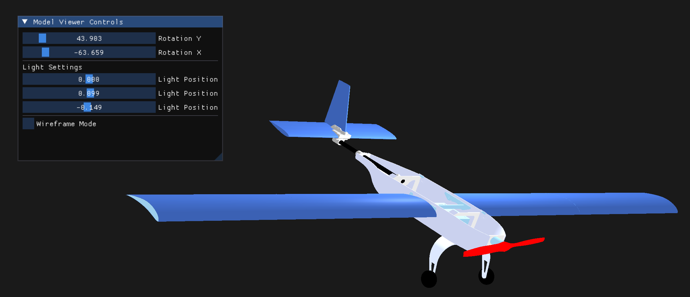

# 3D-Model-Viewer

## Overview
The 3D Model Viewer is a lightweight application designed to load, display, and interact with 3D models. It provides an intuitive interface for users to explore 3D assets with ease. The application leverages **imGUI** for user interface controls and supports various 3D model formats.



## Features
- Load and render 3D models.
- Rotate, zoom, and pan the camera.
- Adjust lighting and shading settings.
- User-friendly controls via **imGUI**.
- Easily extendable

### Prerequisites
Ensure you have the following installed on your system:
- **CMake** (version 3.14 or higher)
- **A C++ compiler** with C++20 support (e.g., GCC, Clang, or MSVC)
- **OpenGL** (with appropriate drivers)
- **GLFW** (for window management)
- **Assimp** (for model loading)

On macOS, you can install dependencies using Homebrew:
```bash
brew install cmake glfw assimp
```

## Build Instructions
1. **Clone the Repository**:
    ```bash
    git clone https://github.com/your-repo/3D-Model-Viewer.git
    cd 3D-Model-Viewer
    ```

2. **Build the Project**:
    ```bash
    make UAV
    ```

3. **Run the Application**:
    ```bash
    ./build/app
    ```

## Usage Instructions
### Camera Controls
Rotate Camera: Use mouse to move camera.
Movement: WASD keys
Zoom In/Out: Use the scroll wheel.

### imGUI Settings
- **Wireframe Mode**: Toggle between solid and wireframe rendering.
- **Lighting Options**: Adjust ambient, diffuse, and specular lighting parameters.
- **Model Transformations**: Modify the position, rotation, and scale of the loaded model.

## Supported File Formats
- `.obj`
- `.fbx`
- `.stl`
- `.glb`
